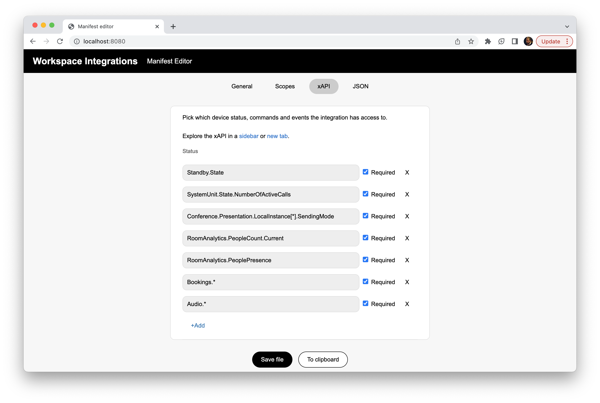

# Webex Workspace Integrations Manifes Editor

This is a free-to-use, open source developer tool for working with the manifest files for
<a href="https://developer.webex.com/docs/api/guides/workspace-integrations-guide">Webex Workspace Integrations</a>.

It is a client-only web application and is hosted on <a href="https://cisco-ce.github.io/workspace-integrations-editor">https://cisco-ce.github.io/workspace-integrations-editor</a>.

*Author: Tore Bjølseth, Cisco*

PR's are welcome!

## Purpose

The purpose of the editor is to quickly get you started making a manifest file, as well as making life easier by:

* Explain the fields you need to define
* Automatically updating version numbers
* Providing select options where applicable
* Auto-complete available integration scopes
* Make it easy to find appropriate device xAPIs

There is also a raw JSON editor, in case there are options that the editor has overlooked.
